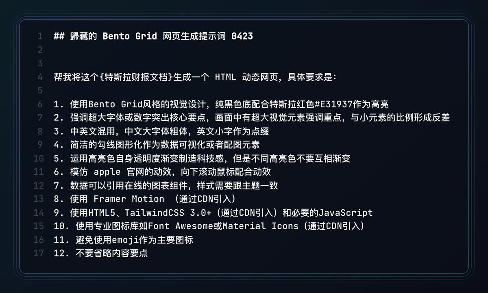

# 🫁 MedBento AI：医学研究报告 Bento 可视化与自媒体智能切片系统

<div align="center">



[](https://github.com/TrojanFish/MedBento)
[](server.py)
[](Dockerfile)
[](LICENSE)

一套专为医学科研论文、肿瘤临床试验报告（JCOG / ASCO / The Lancet / NEJM）与医疗健康自媒体科普打造的 **Bento Grid 动态仪表盘与小红书/抖音/方图 5~8 张高清自适应智能切片系统**。

[功能特性](#-核心功能一览) • [快速开始](#-快速开始与部署指引) • [目录结构](#-项目目录结构全景) • [配置说明](#-环境变量配置说明)

</div>

---

## 🌟 核心功能一览

### 1. 📑 JCOG 早期肺癌里程碑研究本地化与全景解析
- 选取全球胸外科具有颠覆意义的 **JCOG0802 / WJOG4607L（发表于《The Lancet》柳叶刀）** 早期非小细胞肺癌（≤2cm）解剖性肺段切除 vs 肺叶切除 III 期临床试验。
- 完整沉淀核心循证数据（N=1,106，5年 OS 94.3% vs 91.1%，HR 0.663，P=0.0082，FEV1 肺功能损失 -8.5% vs -12.0%，局部切缘复发率 10.5% vs 5.4%）。
- 提供专业矢量排版的中英双语报告：[`output/JCOG0802_Lancet_Study_Report.pdf`](output/JCOG0802_Lancet_Study_Report.pdf) 与详尽文本报告 [`input/JCOG0802_Lancet_Study_Report.txt`](input/JCOG0802_Lancet_Study_Report.txt)。

### 2. 🌐 全格式文献输入、在线网页抓取与 Markdown 双模工作区
- **多格式文档解析**：
  - 📑 **PDF 格式 (`.pdf`)**：纯前端即时解析 + 后端 Gemini 原生多模态 PDF 视觉直读；
  - 📝 **Word 文档 (`.docx`)**：集成 `mammoth.js` 自动提取段落与表格；
  - 📄 **Markdown (`.md`) / 纯文本 (`.txt`) / JSON (`.json`) / HTML (`.html`)**；
- **🌐 在线医学网页/论文链接 (URL) 一键抓取**：
  - 支持直接输入 **PubMed、The Lancet、Nature、ASCO、微信公众号、学术医学新闻等公开网页链接**；
  - 内置 SSRF 白名单安全防御机制与 Jina Reader 高速解析代理，一键秒级提取正文为规范 Markdown；
- **📊 Markdown / 复杂临床数据表双模工作区**：
  - 支持 **【📝 源码编辑】** 与 **【👁️ 表格/排版渲染】** 一键无缝切换；
  - 集成 `marked.js` 表格渲染引擎，完美支持医学试验终点对照表与一键插入表格模板。

### 3. 📊 桌面 Bento Grid 仪表盘视图
- **Apple 质感大数字 KPI 卡**：5年 OS 生存率、HR 死亡风险比、12个月肺功能损失、总样本量；
- **动态 Kaplan-Meier 阶梯生存曲线**：支持 **OS（总生存）** 与 **RFS（无复发生存）** 双终点自由切换，坐标轴刻度依据临床数据自适应计算；
- **多指标对比图与临床全景对照表**：试验组 vs 对照组多维胜出分析，区分临床医生同行视角与通俗患者科普视角。

### 4. 📱 智能自适应 5~8 张自媒体卡片切片体系
- **篇幅自由切换与智能自适应**：
  - **⚡ 智能自适应 (`auto`)**：根据文献深度与信息丰富度自动识别匹配 5~8 张；
  - **5张 · 爆款精炼模式**：核心大字封面卡、试验设计卡、KM 生存阶梯曲线卡、临床获益与局部复发权衡卡、患者就医四步指南卡；
  - **7张 · 深度临床模式**：新增 **【第 6 张：安全性与不良反应谱卡 (Grade 3+ AE、肺漏气与非癌死因)】**、**【第 7 张：关键预设亚组 5 年 OS 获益森林图卡】**；
  - **8张 · 全景全案模式**：新增 **【第 8 张：权威指南共识 (NCCN/CSCO 1A 类) 与 4 步全流程诊疗路径卡】**；
- **所见即所得微调**：卡片上所有文字支持鼠标点击直接编辑，即时生效于导出图片。

### 5. 🎨 3 款高质感视觉主题
- 🌙 **暗黑科技风 (`theme-dark`)**：深蓝黑底 + 霓虹青绿，赛博现代感；
- 📜 **便签纸暖白 (`theme-light`)**：柔和暖黄便签羊皮纸底色 (`#FAF7EE`) + 深炭灰字 + 经典医学蓝，温润护眼、手记质感，极其契合小红书；
- 🧪 **蓝绿生命风 (`theme-emerald`)**：深邃森林墨绿 + 薄荷荧光，生物医药前沿学术风。

### 6. 🖼️ 全矢量 100% SVG 引擎与 4K 超高清无损导出
- **100% 原生矢量 SVG 图标**：告别 WebFont 跨域字体加载失败导致的 `☒` 乱码方块，确保图片渲染零瑕疵；
- **现代 `html-to-image` 渲染引擎**：基于 SVG `<foreignObject>` 原生 DOM 像素级还原，自动规避 Canvas 渐变文字白框问题；
- **多比例自由切换**：小红书 3:4 (1080×1440) | 抖音/竖屏 9:16 (1080×1920) | 方图 1:1；
- **多元化导出能力**：支持 **单张卡片一键下载 (PNG)**、**全套切片批量打包 (ZIP)**、**完整无缝长图拼接 (PNG)**；
- **📝 独立文案工作台**：自带字数统计、Emoji 结构化段落、Hashtag 热门标签，双向同步编辑并一键复制。

### 7. 🔒 安全防护与生产就绪
- **VPS 私有化鉴权体系**：全站路由守卫，防未授权盗刷，支持 30 天 HttpOnly Session Token；
- **环境变量安全隔离**：后端统一代理 Gemini 大模型请求，`.env` 严格由 `.gitignore` 保护不泄露；
- **API 智能容错**：支持指数退避重试（应对 429/503），未配置 Key 时自动启用内置离线启发式引擎。

---

## 🚀 快速开始与部署指引

### 1. 克隆代码仓库

```bash
# 克隆项目到本地
git clone https://github.com/TrojanFish/MedBento.git
cd MedBento
```

---

### 2. 配置环境变量

```bash
# 复制环境变量模板
cp .env.example .env

# 编辑 .env 文件（可选填入您的 Gemini API Key 和自定义访问密码）
# Windows PowerShell 用户可直接用记事本打开：
notepad .env
```

`.env` 核心配置项示例：
```ini
# 私有化访问密码（留空则为免密模式）
AUTH_USERNAME=admin
AUTH_PASSWORD=medbento2026

# Google Gemini API Key（留空则使用内置离线高质量医学引擎）
GEMINI_API_KEY=your_gemini_api_key_here
GEMINI_MODEL=gemini-2.5-flash

# 服务端口（默认 38999）
PORT=38999
HOST=0.0.0.0
```

---

### 3. 运行服务

#### 方式一：本地 Python 轻量启动（无需额外框架，零外部依赖）

```bash
# 使用 Python 标准库直接启动
python server.py
```

打开浏览器访问：👉 **`http://localhost:38999`**

* 默认账号：`admin`
* 默认密码：`medbento2026`（可在 `.env` 中修改）

---

#### 方式二：Docker / Docker Compose 一键部署（推荐 VPS / 云服务器）

```bash
# 后台构建并启动容器
docker compose up -d --build

# 查看运行日志
docker compose logs -f
```

启动完成后，直接在浏览器访问：👉 **`http://<服务器IP>:38999`**

---

### 4. 代码更新与维护

```bash
# 获取最新版本代码
git pull origin main

# 重启 Python 进程或 Docker 容器即可完成升级
docker compose restart
```

---

## 📂 项目目录结构全景

```
MedBento/
├── 📄 .env.example                         # 🔑 环境变量配置模板（公开安全示例）
├── 📄 .gitignore                           # 🛡️ Git 忽略规则清单（保护 .env 及私密数据）
├── 📄 .dockerignore                        # 🐳 Docker 构建忽略清单
├── 📄 Dockerfile                           # 🐳 Docker 生产镜像构建文件
├── 📄 docker-compose.yml                   # 🐳 Docker Compose 容器编排配置
├── 📄 requirements.txt                     # 📦 Python 依赖配置（轻量化标准环境）
├── 📄 README.md                            # 📖 项目官方完整使用与部署文档
│
├── 🌐 server.py                            # 🚀 Python 后端轻量服务器（鉴权网关、Gemini 代理、SSRF 防御）
├── 🌐 index.html                           # 💻 Web 主界面（Bento 仪表盘 + 自媒体切片工作区）
├── 🌐 login.html                           # 🔒 私有化安全登录与身份验证页面
│
├── 🎨 css/                                 # 页面样式体系
│   └── style.css                           # 核心设计系统（暗黑科技、便签纸暖白、蓝绿生命三主题）
│
├── ⚙️ js/                                  # 前端交互与可视化核心引擎
│   ├── app.js                              # 页面主控制器、状态管理、图表渲染与事件绑定
│   ├── card_slicer.js                      # 自媒体 5~8 张自适应智能切片器（100% 纯矢量 SVG 图标引擎）
│   ├── exporter.js                         # html-to-image 4K 超高清导出、ZIP 打包与文案生成器
│   ├── medical_analyzer.js                 # 医学数据解析器、规范化映射与离线启发式引擎
│   └── pdf_extractor.js                    # 全格式文档解析 (PDF/Word/MD/HTML/URL 在线抓取)
│
├── 📥 input/                               # 原始文献素材与参考输入
│   ├── README.md                           # 输入目录说明
│   ├── JCOG0802_Lancet_Study_Report.pdf    # 原始 JCOG 柳叶刀文献 PDF
│   ├── JCOG0802_Lancet_Study_Report.txt    # 原始 JCOG 临床试验数据全文
│   └── prompt.jpg                          # 原始参考财报提示词架构图
│
├── 📤 output/                              # 产物与导出成果目录
│   ├── README.md                           # 产物输出说明
│   ├── JCOG0802_Lancet_Study_Report.pdf    # 自动生成的排版学术 PDF
│   └── optimized_medical_prompt.md         # 重构后的医学 Bento 结构化提示词
│
├── 📑 templates/                            # 结构化提示词模板
│   └── prompt_template.json                # 3 种医学自媒体风格的结构化 Prompt 模板
│
└── 🛠️ scripts/                              # 自动化工具脚本
    └── generate_jcog_pdf.py                # Python PDF 矢量生成脚本
```

---

## ⚙️ 环境变量配置说明

| 变量名 | 默认值 | 说明 |
| :--- | :--- | :--- |
| `AUTH_USERNAME` | `admin` | 管理员登录账号 |
| `AUTH_PASSWORD` | `medbento2026` | 访问网关密码（**留空则自动开启免密模式**） |
| `GEMINI_API_KEY` | *(空)* | Google Gemini API Key（可在 [Google AI Studio](https://aistudio.google.com/) 免费获取） |
| `GEMINI_MODEL` | `gemini-2.5-flash` | Gemini 模型版本（推荐 `gemini-2.5-flash` 或 `gemini-1.5-pro`） |
| `PORT` | `38999` | HTTP 服务监听端口（非标高位端口，避免 VPS 端口冲突） |
| `HOST` | `0.0.0.0` | 服务监听地址（支持局域网及 Docker 外部映射） |

---

## 🛡️ 医学免责与学术声明

本系统内容基于《The Lancet》（DOI: [10.1016/S0140-6736(21)02333-3](https://doi.org/10.1016/S0140-6736(21)02333-3)）与 JCOG 官方公开临床数据编译与可视化呈现，仅供学术科研交流与健康科普参考，不构成任何临床诊疗方案推荐。具体手术适应症与治疗决策请严格遵从专业三甲医院胸外科及肿瘤科执业医师意见。

---

<div align="center">
  <b>MedBento AI</b> · 让医学文献更有视觉穿透力 🫁
</div>
